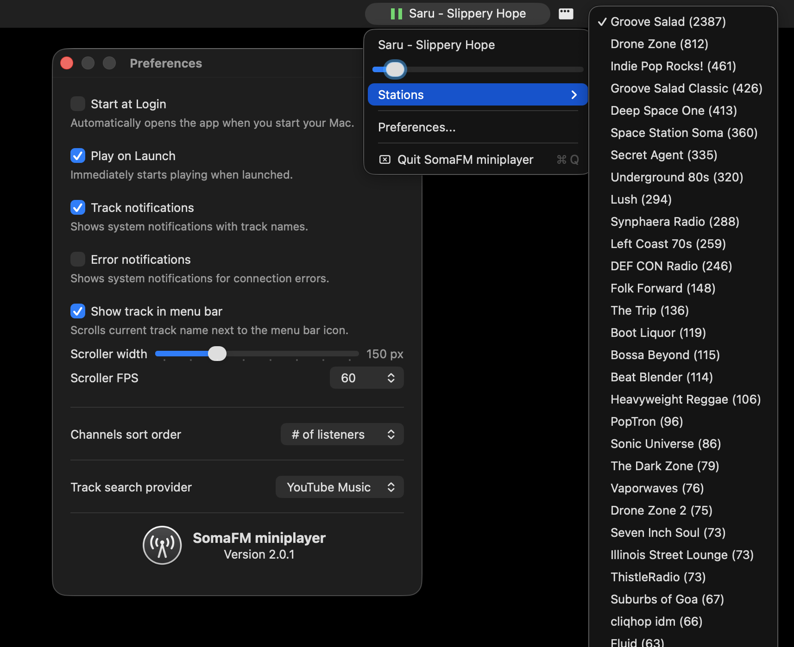

# SomaFM miniplayer

[](https://github.com/meboev/SomaFM-miniplayer/releases/latest)
[](LICENSE.md)
-lightgrey.svg)



This is an unofficial player that gives you minimal, background playback of SomaFM channels on macOS.

## Capabilities

* Menu bar controls with colored status icons (red/amber/green, adaptive for light/dark mode)
* Scrolling track name in menu bar with configurable width and frame rate
* Media key support (play/pause, previous/next station) via keyboard, Control Center, Lock Screen, and Bluetooth devices
* Now Playing integration with station artwork in Control Center and Lock Screen
* System notifications for track changes with station artwork
* Stations menu with listener counts and genre tooltips
* Track search integration (YouTube Music, Spotify, Apple Music)
* Automatic reconnection on network errors (5s retry)
* Persistent play mode (survives app restarts)
* Start at Login support
* Configurable channels sort order

## Installation

* Download the DMG from the [releases page](https://github.com/meboev/SomaFM-miniplayer/releases/latest)
* Or clone this repo and build it from source:

```bash
./build.sh
./create-dmg.sh
./install.sh
```

## Changes in 2.0.1

* Colored menu bar icons: red (stopped), amber (connecting/offline), green (playing) — darker variants in light mode
* Added scrolling track name in menu bar ("Show track in menu bar" preference)
* Configurable scroller width (50–400px, default 50px) and frame rate (5–60fps, default 60fps)
* Added persistent play mode with automatic retry on network errors
* Now Playing integration with station artwork (Control Center, Lock Screen, media keys, Bluetooth controls)
* Previous/next media keys switch stations
* Track notifications now include station artwork
* Stations menu shows listener counts and genre tooltips
* Informative menu bar icon tooltip (version, station, description, current track)
* Added "Error notifications" preference (disabled by default)
* Renamed "Enable notifications" to "Track notifications"
* Renamed "Music search provider" to "Track search provider"
* Removed all modal error dialogs — errors shown via system notifications (if enabled)
* Fixed channel description decoding bug
* Replaced all `URLSession` instances with shared session
* Removed `NSAllowsArbitraryLoads` (all endpoints are HTTPS)
* Code cleanup: removed dead code, updated copyrights, modernized to `@main`

## Changes in 2.0.0

* Apple Silicon only (arm64)
* Removed all Carthage dependencies (Reachability, MediaKeyTap)
* Replaced Reachability with built-in `NWPathMonitor`
* Replaced MediaKeyTap with built-in `MPRemoteCommandCenter`
* Replaced `NSUserNotification` with `UserNotifications` framework
* Replaced deprecated `SMLoginItemSetEnabled` with `SMAppService`
* Fixed stream playback by resolving PLS playlists and adding User-Agent header
* Track metadata fetched via SomaFM songs API (ICY metadata no longer works on macOS 15+)
* Updated Swift to 5.0, deployment target to macOS 14.0
* Removed shell script build phases (swiftlint, git version bump)
* Added build, install, and DMG creation scripts

## Authors

Originally created by Evgeny Aleksandrov ([@ealeksandrov](https://twitter.com/ealeksandrov)).

Maintained and updated by Milen Boev ([@meboev](https://github.com/meboev)).

## License

`SomaFM miniplayer` is available under the MIT license. See the [LICENSE.md](LICENSE.md) file for more info.
